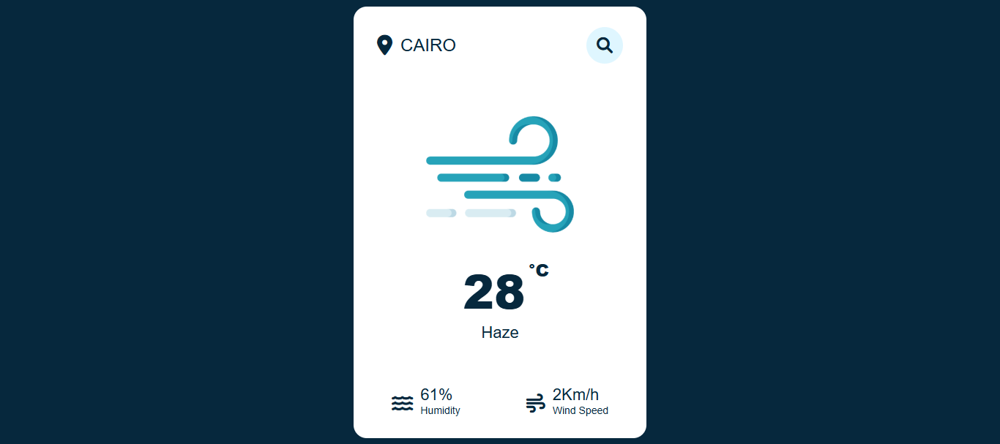

# 🌡️ Temperature Checker

A simple web app to display the current temperature based on the user’s input location using a weather API (or simulated data).

## 🛠️ Built With
- HTML
- CSS
- JavaScript

  
## 🌐 Live Demo
[View on GitHub Pages](https://youssefmohamed18.github.io/Temperature-Checker)

## 🔍 Preview

---

## 👨‍💻 Developed by:
[Youssef Mohamed](https://www.linkedin.com/in/youssef-mohamed00/)
